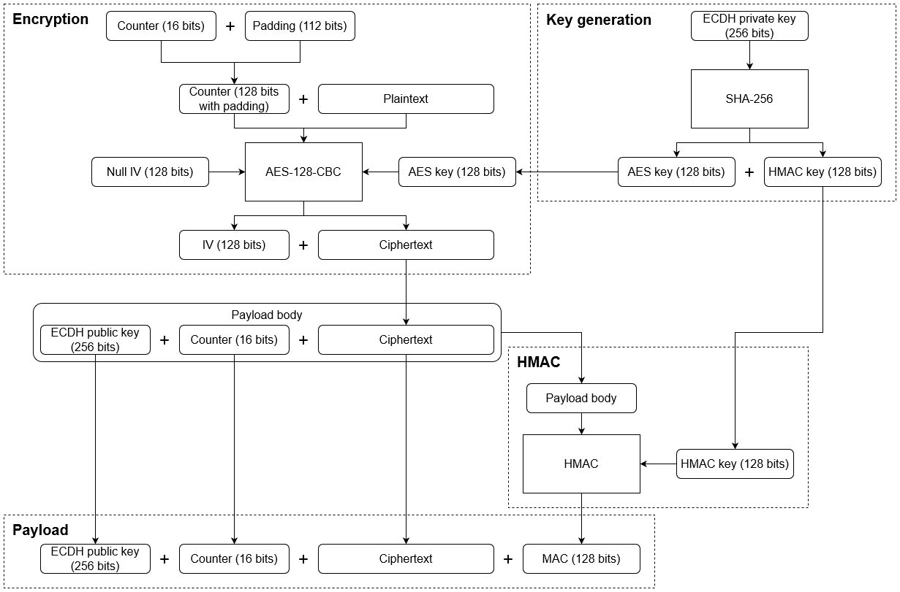
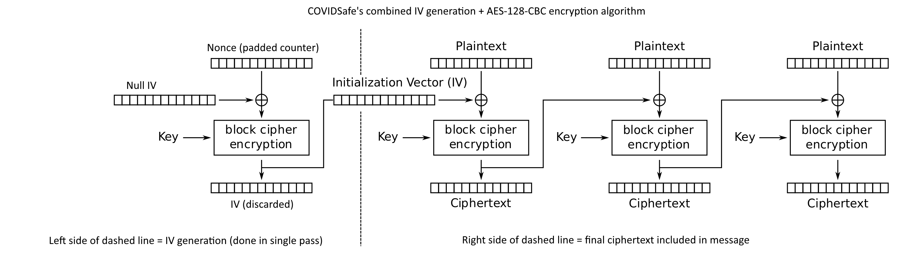

This is part of a series of blog posts on automated contact tracing, especially (but not only) Australia's COVIDSafe app.

The complete list is:

- [Tweaking Tracetogether (30 Mar)](https://github.com/vteague/contactTracing/blob/master/blog/2020-03-30TweakingTracetogether.md)
- [Contact Tracing without Surveillance (7 Apr)](https://github.com/vteague/contactTracing/blob/master/blog/2020-04-07ContactTracingWithoutSurveillance.md)
- [Contact Tracing and Consent (23 Apr)](https://github.com/vteague/contactTracing/blob/master/blog/2020-04-23ContactTracingAndConsent.md)
- [Tracing the Challenges of COVIDSafe (27 Apr)](https://github.com/vteague/contactTracing/blob/master/blog/2020-04-27TracingTheChallenges.md) by Chris Culnane, Eleanor McMurtry, Robert Merkel and me.
- [The Missing Server Code and why it Matters (14 May)](https://github.com/vteague/contactTracing/blob/master/blog/2020-05-14TheMissingServerCode.md)  by Robert Merkel, Eleanor McMurtry and me.
- [Security Analysis of the UK's NHS Contact Tracing App](https://github.com/vteague/contactTracing/blob/master/blog/2020-05-19UKContactTracing.md) by Chris Culnane and me.
- [**COVIDSafe's new payload encryption scheme (15 June) - this post**](https://github.com/vteague/contactTracing/blob/master/blog/2020-06-15COVIDSafesNewEncryptionScheme.md) by Chris Culnane, Ben Frengley, Eleanor McMurtry, Jim Mussared, Yaakov
 Smith, Alwen Tiu and me.
- [Issues with COVIDSafe's new encryption scheme (19 June)](https://github.com/vteague/contactTracing/blob/master/blog/2020-06-19IssueswithCOVIDSafesNewEncryptionScheme.md) by the same authors.
- [The current state of COVIDSafe (mid-June 2020) (22 June)](https://github.com/vteague/contactTracing/blob/master/blog/2020-06-22OutstandingPrivacyIssues.md) by the same authors.
- [COVIDSafe issues found by the tech community (7 July, updated 1 Jan 2021)](https://github.com/vteague/contactTracing/blob/master/blog/2020-07-07IssueSummary.md) by Jim Mussared and me.
- [Fools rush in where angels fear to tread - why Herald won't be ready by Christmas](https://github.com/vteague/contactTracing/blob/master/blog/2020-12-07COVIDSafeHerald.md) by Jim Mussared and me.
- [Why GAEN Exposure Information should be shuffled relative to Diagnosis Keys (16 Dec)](https://github.com/vteague/contactTracing/blob/master/blog/2020-12-16TheImportanceOfShufflingInGAEN.md)
- 
---------------------------------------

# COVIDSafe's new payload encryption scheme.

Chris Culnane: [stateofit.com](https://stateofit.com) / [@chrisculnane](https://twitter.com/chrisculnane)   
Ben Frengley: ben.frengley [at] gmail.com / [@bgf_nz](https://twitter.com/bgf_nz),   
Eleanor McMurtry: [eleanorm.info](https://eleanorm.info) / [@noneuclideangrl](https://twitter.com/noneuclideangrl)   
Jim Mussared: jim.mussared [at] gmail.com / [@jim_mussared](https://twitter.com/jim_mussared)   
Yaakov Smith: [yaakov.online](https://yaakov.online) / [@yaakov_h](https://twitter.com/yaakov_h)   
Vanessa Teague: [ThinkingCybersecurity Pty Ltd](https://www.thinkingcybersecurity.com) / [@VTeagueAus](https://twitter.com/vteagueaus)   
Alwen Tiu: The Australian National University alwen.tiu [at] anu.edu.au


COVIDSafe was overhauled in late May, introducing a completely new cryptographic protocol (Version 2). This was included in the 1.0.18 release for Android, and the 1.4 release for iOS. The changes mostly improved privacy, though some existing privacy issues remain unaddressed and some new ones were introduced.

Despite a subsequent update to COVIDSafe (1.0.21 for Android / 1.5 for iOS), there are some issues with this new protocol that we will described in a second post after a further update is released.  Also, a recent post by Richard Nelson explains that the new version of [COVIDSafe cannot retrieve a new TempID when running on a locked iPhone](https://docs.google.com/document/d/1dsSxC48cJ91X17PoOybpun1U163YDxxL0CDk3kmAHvY/preview). 

The purpose of this post is to provide enough background detail on COVIDSafe Version 2 to allow readers to understand its issues.

## Background: the issues that led to the new scheme
Bluetooth-based device tracking has been a problem since long before COVID apps.  The attacker's goal is to track a device over long periods of time by extracting an identifier from the phone that doesn't change.   The aim of a good protocol is to defend against this by reducing or eliminating long-term identifiers.

Two such identifiers used in COVIDSafe are:

* The phone's model name (e.g. "Samsung Galaxy G8"). This is included in the Bluetooth data exchange in order to calibrate the signal-strength to distance calculation used to evaluate a given encounter. Because of the huge diversity of phone models (especially on Android devices), this forms an uncommon or unique identifier for a given phone.

* The TempID. The COVIDSafe app works by exchanging random-looking messages (TempIDs) between phones via Bluetooth. This changes every 2 hours.  In version 1, this allowed a device to be [tracked for up to two hours via this ID](https://github.com/vteague/contactTracing/blob/master/blog/2020-04-27TracingTheChallenges.md).

These two identifiers could be used in conjunction to facilitate tracking -- for example, two subsequent TempIDs from the same device could be linked if the device model was the same. Even if other devices of the same model were in range, it would be unlikely that their TempID would change at the same instant.

COVIDSafe version 1, like the [BlueTrace protocol](https://bluetrace.io/static/bluetrace_whitepaper-938063656596c104632def383eb33b3c.pdf) it was based on, involved exchanging a payload containing a JSON blob, and the TempID and phone model were part of this blob. 

## Key rotation: the main gain of COVIDSafe version 2

In version 2, a significant boost in privacy is achieved by using an authority's public key to encrypt the tracing payloads in a way that changes their appearance every 7.5 minutes.  This means that:

* The TempID and phone model are no longer visible.
* The payload changes completely for every new key, reducing the tracking interval to 7.5 minutes (approximately how long the device uses the same MAC address for, though the latter varies widely).

The app does this by generating an *ephemeral key* that is used to encrypt the BlueTrace payload. Whenever a Bluetooth message needs to be generated, if it has been more than 7.5 minutes since the key has been changed, the app generates a new ephemeral key. A detailed explanation of this procedure can be found in the [Encryption Method Section](#EncryptionMethod).

This hides the phone model name (e.g. "Pixel 2") from the recipient and obscures the repeated use of the same TempID past 7.5 minutes, even though the 2-hour TempID window has not changed. The app will also apply this encryption to existing records in its log of earlier contacts, and to any plaintext TempIDs it receives from people using older versions of COVIDSafe.

## Was this the best way to solve the problem?

The new encryption scheme comes at a fairly high implementation cost and complexity.  It was introduced without significant open review or even a detailed public specification. It inevitably introduces the possibility of other attacks and issues. For this reason it's worth considering other alternatives.

### Did we need phone model at all?

The phone model should have just been removed altogether from the payload. There does not appear to be a convincing justification for why the phone model helps calibrate the signal-strength to distance calculation as the RSSI is highly dependent on many other factors due to the nature of antennas and radio signals. Other countries using OpenTrace have confirmed that they are ignoring the phone model when doing contact tracing, relying instead on RSSI being a crude binary indication of "near" vs "far".

See [Coronavirus Contact Tracing: Evaluating The Potential Of Using Bluetooth Received Signal Strength For Proximity Detection (Douglas J. Leith, Stephen Farrell)](https://www.scss.tcd.ie/Doug.Leith/pubs/bluetooth_rssi_study.pdf) for an in-depth discussion.

The DTA's [own testing plans for COVIDSafe](https://www.aph.gov.au/DocumentStore.ashx?id=1717dded-c0b0-4c6f-b299-cbde7f3daea0) do not show the phone model as one of the fields displayed when querying the encounter logs for an individual who has uploaded their records, so it's not clear that the server even uses this data.

Additionally, the phone model is still available from iPhone devices through a separate mechanism, so this additional encryption does nothing to solve this issue for iPhones. And on both iPhone and Android, the phone name is also available, and although this field is user-configurable, it often defaults to the phone model, providing the exact same information.

## More opportunities from public-key cryptography

### Hiding the contact graph from AWS

Public key encryption could hide the contact graph from AWS, reduce the gathering of 2-hourly metadata, and implement the promise of state-only decryption.

The use of public key encryption introduces a new opportunity for improved privacy protection from the Amazon Web Services (AWS) server: if the private key from the authority's ECDH keypair was stored by a public health authority, rather than by AWS itself, then the contact list that each infected person uploads would be unreadable by AWS. This would mean that the health authority, but not AWS, learns who had been in contact with whom. (Of course, there would need to be some way for AWS to tell the Australian health authority which TempIDs corresponded to which users, but this is easily achievable.) We believe a [similar separation will be made in the UK](https://www.ncsc.gov.uk/blog-post/nhs-covid-19-app-security-two-weeks-on), though they too use a US-based cloud provider for receiving the encrypted contact list. This might go a significant way to ameliorating community concern over the privacy implications of AWS's control of the database -- if the contacts were encrypted in a way that AWS couldn't decrypt, then many of the questions about potential enforced US access to that information would disappear. Of course, concern over possible extrajudicial access by authorities in Australia, the US, or other entities would remain.

Importantly, this concern would only be truly addressed if the source code was made openly available for independent public scrutiny.  Given the problems that have been identified in the app code, it is safe to assume that similar errors remain undetected on the server side.  A process of open independent review, like that which has improved the app code, could also improve the server side and potentially deliver enormous benefits for both security and public trust.

### No need for two-hourly TempID downloads

It has never been clear why the TempID should be downloaded two-hourly from AWS.  From the beginning, a much simpler alternative would have been instead to make the TempID itself last for a shorter time interval, and to be downloaded in daily batches. This was not just our recommendation in an [earlier post](https://github.com/vteague/contactTracing/blob/master/blog/2020-04-27TracingTheChallenges.md) but also the recommendation of the BlueTrace designers. It's worth noting that all other OpenTrace implementations that we're aware of (Singapore, Alberta, Morocco) currently use the 15-minute expiry and batching scheme.

The use of public key encryption, however, removes the need for regular TempID downloads entirely. Now that the app can construct its own encrypted Bluetooth payload, the TempID could persist for weeks or months, though it probably needs to be refreshed if the person is infected or notified of exposure.  As well as the privacy gain, this would reduce the load on AWS and hence (we assume) the cost to the Australian taxpayer.

### Who holds the decryption key?

The use of public-key encryption could allow the Australian authorities to implement the promise that COVIDSafe app data would be available only to the appropriate health authorities in each state.  In version 1, this clearly wasn't possible, because all the decryption capability was centralised with AWS.  The use of public keys makes this possible.  Unfortunately, though, this has not been implemented yet: we have checked apps downloaded in Victoria and NSW, each registered with a postcode appropriate to that state. Both use the same public key in the current version.  Thus the promise that only your state-level authority can decrypt your data is a procedural restriction, not yet implemented as a cryptographic protection.  It almost certainly could be implemented as a cryptographic protection, though we have not worked through all the details.

## Implementation details
The rest of this post explains the details of how the cryptography works, which will be helpful later in the week as we explain more of the issues.

<a name="EncryptionMethod"></a>
### Encryption method

The encryption method consists of two parts. In the first part, approximately every 7.5 minutes, the app generates an ephemeral Elliptic Curve Diffie–Hellman (ECDH) public-private key pair (*ephemeral keypair*). It then uses Diffie–Hellman key agreement with the authority's public key (compiled into the app) to generate two temporary secret keys: a 128-bit AES key, and a 128-bit HMAC key. The counter is reset to zero.

The second part is the actual encryption. It is redone every time a new payload needs to be encrypted, which is either because the device is sending a payload to another device, or an incoming version 1 message needs to be "upgraded" to version 2 before being logged. The counter is increased by one each time.

First, the counter is encrypted using the AES key to form a random-looking *initialisation vector (IV)*. This IV is guaranteed to be different each time, for the lifetime of the AES key.
Then the IV is used with AES in CBC mode to encrypt the message.

Finally, the HMAC key is used to compute an HMAC on the ephemeral public key, counter value, and encrypted message. The variant of HMAC used is [HMAC-SHA-256-128](https://tools.ietf.org/html/rfc4868#section-2.6), i.e., HMAC-SHA-256 truncated to 128 bits.

This construction resembles [AES-128-CBC-HMAC-SHA-256 authenticated encryption with associated data (AEAD)](https://tools.ietf.org/id/draft-mcgrew-aead-aes-cbc-hmac-sha2-03.html).

<!-- Generating pseudorandom IVs using the AES key is explicitly prohibited, but we do not see an attack.  !-->

This is illustrated in the diagram below. The plaintext is the tracing payload, including the TempID and other data such as phone model.



The final encrypted payload message is then the following, where `|` means concatenation:

```
ephemeral public key | counter | encrypted message | HMAC
```

When the authority receives such a message, it can use its ECDH private key to reconstruct the AES and HMAC secret keys. This allows it to decrypt the message and check that the encryption really was done with the ephemeral keypair that it claims to have been.

The code is below. The Cipher object is declared as a class variable:

```kt
private val symCipher: Cipher = makeSymCipher()
```

It is used in the `encryptPayload` function:

<a name="EncryptPayloadFunction"></a>

```kt
fun encryptPayload(data: ByteArray): String {

        val keys = encryptionKeys()

        val prefix: ByteArray = keys.ephPubKey.plus(keys.nonce)

        // Encrypt
        // IV = AES(ctr, iv=null), AES(plaintext, iv=IV) === AES(ctr_with_padding || plaintext, iv=null)
        // Using the latter construction to reduce key expansions
        val ivParams = IvParameterSpec(ByteArray(16))  // null IV
        symCipher.init(Cipher.ENCRYPT_MODE, keys.aesKey, ivParams)
        val ciphertextWithIV: ByteArray = symCipher.doFinal(keys.nonce.plus(NONCE_PADDING).plus(data))

        // MAC
        val size: Int = ciphertextWithIV.size - 1
        val blob: ByteArray = prefix.plus(ciphertextWithIV.sliceArray(16..size))
        val mac: ByteArray = computeMAC(keys.macKey, blob)

        return Base64.encodeToString(blob.plus(mac), Base64.DEFAULT)
    }
```

It is more common to perform these kinds of routines using libraries such as the Australian [BouncyCastle](https://www.bouncycastle.org/) rather than attempting to implement them yourself. It is not clear why this approach was taken. Further, AES-GCM has shorter ciphertexts than AES-CBC and is implemented in the standard Java cryptography library.

## Conclusion

This post provides background information to help users understand the new protocol.  We'll be following up through the week with more explanation of some of the problems in the current version.  

## Appendix

This section contains some specific additional implementation details about the protocol and encryption implementation that may be of interest to some readers.

### Payload structure

The version 1 JSON payload contains the following fields:

* `"v"`: number
* `"org"`: number
* `"msg"`: string (the TempID)
* `"modelP"`: string (the phone model, *peripheral role only*)
* `"modelC"`: string (the phone model, *central role only*)
* `"rssi"`: number (the RSSI at the central, *central role only*)
* `"txPower"`: number (the TX power of the peripheral, *central role only*)

This ends up generating an approximately 150 byte BLE payload from an approximately 80 byte TempID.

When an encounter is logged, the sent and received payloads are combined such that the log contains both phone models, the remote devices' TempId, and the RSSI and TX power.

These payloads look like this:

```
# Peripheral to Central
{"v": 1, "msg": "...Peripheral TempID (base64)...", "modelP": "Pixel 2", "org": "AU-DTA"}
# Central to Peripheral
{"v": 1, "msg": "...Central TempID (base64)...", "modelC": "Samsung Galaxy G8", "rssi": -70, "txPower": 4, "org": "AU-DTA"}
# Logged payload on the Periperhal
{"v": 1, "msg": "...Central TempID (base64)...", "modelP": "Pixel 2", modelC": "Samsung Galaxy G8", "rssi": -70, "txPower": 4, "org": "AU-DTA"}
# Logged payload on the Central
{"v": 1, "msg": "...Peripheral TempID (base64)...", "modelP": "Pixel 2", modelC": "Samsung Galaxy G8", "rssi": -70, "txPower": 4, "org": "AU-DTA"}
```

The version 2 payload is a version 1 payload encrypted inside the same structure, except all fields other than `"msg"`, `"v"`, and `"org"` are replaced with dummy or null values.

The encrypted blob, as described above, is the concatenation of:
* 1 byte (flag)
* 32 bytes (ephemeral public key)
* 2 bytes (counter)
* variable bytes (encrypted v1 JSON payload, base64 encoded)
* 16 bytes (HMAC)

```
# Peripheral to Central
{"v": 2, "msg": "...encrypted version 1 json (base64)...", "modelP": "", "org": "AU-DTA"}
# Central to Peripheral
{"v": 1, "msg": "...encrypted version 1 json (base64)...", "modelC": "Samsung Galaxy G8", "rssi": 9999, "txPower": 9999, "org": "AU-DTA"}
```

This results in an approximately 350 byte payload from the same (approximately 80 byte) TempID.

### The tracing exchange process

A peripheral role device, acting as a GATT server, advertises the streetpass GATT service via BLE advertising beacons. A central role device can scan for these beacons and connect to the peripheral as a GATT client. This service contains a single GATT characteristic, and the two devices exchange data by the client reading and writing the value of this characteristic.

A central can record the (RSSI) signal strength of a scanned peripheral, and the peripheral can include its transmit power in its advertising payload.

The overall process for when both devices are running version 2 is:

* A central scans and finds a peripheral, noting the RSSI of the received advertisement beacon, and the value of the transmit power field.
* The central connects to the peripheral and issues a read for the characteristic value. The peripheral returns `json(org, v, msg=encrypt(json(modelP, traceID)))`.
* The central writes `json(txpower, rssi, modelC, msg)` to its encounter log, which is effectively `json(txpower, rssi, modelC, encrypted(modelP, traceID))`.
* The central then writes back to the characteristic value its own payload `json(org, v, msg=encrypt(json(modelC, traceID, rssi, txpower)))`.
* The peripheral writes `(modelP, msg)` to its encounter log, which is effectively `(modelP, encrypted(modelC, traceID, rssi, txpower))`.

(Note: the null/dummy fields have been omitted from the payloads, additionally the process to generate the encounter log entry is slightly more complicated as it involves generating a `localBlob` in addition to the `remoteBlob` described above)

### Encryption notes

The encryption algorithm used, while being a close approximation of AES-128-CBC-HMAC-SHA-256, is implemented in a slightly unclear manner. The straightforward implementation would be approximately as follows:

1. Pad the 2-byte counter with 14 `0x0E` bytes
1. Generate the real IV by encrypting the padded counter using a null IV
1. Encrypt the plaintext using the real IV to get the ciphertext
1. Attach the associated data as the header
1. Calculate the HMAC of the header and ciphertext
1. Attach the HMAC following the ciphertext
1. Send the payload (i.e., `header | ciphertext | mac`)

However, to avoid an extra key expansion, they instead calculate the IV and ciphertext using a single encryption operation. This works because of how the CBC mode of encryption functions.

In CBC mode, the ciphertext from the previous block is XORed with the plaintext of the current block before encryption, and for the first block, the IV is used instead of the previous block (because there is no previous block to use). Because the padded counter is exactly one AES block (i.e., 128 bits), encrypting it with a null IV gives an output which is also exactly one AES block. This can be fed as-is into a new AES encryption operation as the IV; it is XORed with the first block of the plaintext, which is then encrypted, and the chain begins there. The combined output of each step of the chain is the final ciphertext.

However, because the next step of the chain is just to XOR the output of the previous block with the next block of plaintext (i.e., exactly what was done with the IV), it's possible to combine these&mdash;if the IV is prepended to the plaintext and then the whole of that is encrypted with a null IV, the first step ends up the same single block encryption used to generate the IV, and the subsequent steps are the normal encryption of the plaintext. This results in an output consisting of the IV as the first block, and the encrypted plaintext as the following blocks. This means that to get the same ciphertext as the two-step way above, the first block (i.e., 16 bytes) of this output must be removed.

This approach is shown in the following diagram: 

As a result of using this single-step approach, the COVIDSafe implementation is as follows:

1. Pad the 2-byte counter with 14 `0x0E` bytes
1. Generate the encryption input by prepending the padded counter to the plaintext
1. Encrypt the input using a null IV
1. Remove the first block of the output (i.e., the IV) to get the ciphertext
1. Attach the associated data as the header
1. Calculate the HMAC of the header and ciphertext
1. Attach the HMAC following the ciphertext
1. Send the payload (i.e., `header | ciphertext | mac`)

Their motivation for this approach, along with a terse assertion of its correctness, is mentioned in a comment in the source code:
```kt
        // IV = AES(ctr, iv=null), AES(plaintext, iv=IV) === AES(ctr_with_padding || plaintext, iv=null)
        // Using the latter construction to reduce key expansions
```

## Acknowledgements
We'd like to thank the large and active community of Australian techies who have examined, discussed, and tried to correct the code, including Richard Nelson, Geoffrey Huntley, xssfox, and many others.

### Followup and reuse

Comments, edits, suggestions and pull requests are welcome.

You are welcome to quote or reprint this article as long as you acknowledge the original source.  Permanent link:
[https://github.com/vteague/contactTracing/blob/master/blog/2020-06-15COVIDSafesNewEncryptionScheme.md](https://github.com/vteague/contactTracing/blob/master/blog/2020-06-15COVIDSafesNewEncryptionScheme.md).
