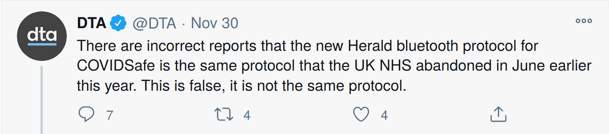
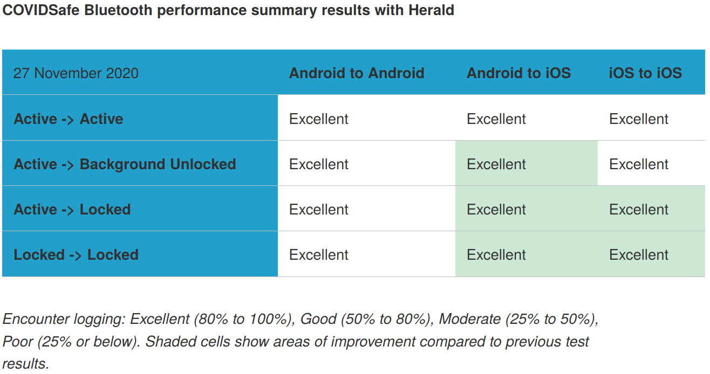

This is the latest in a series of blog posts on automated contact tracing, especially (but not only) Australia's COVIDSafe app.

The complete list is:

- [Tweaking Tracetogether (30 Mar)](https://github.com/vteague/contactTracing/blob/master/blog/2020-03-30TweakingTracetogether.md)
- [Contact Tracing without Surveillance (7 Apr)](https://github.com/vteague/contactTracing/blob/master/blog/2020-04-07ContactTracingWithoutSurveillance.md)
- [Contact Tracing and Consent (23 Apr)](https://github.com/vteague/contactTracing/blob/master/blog/2020-04-23ContactTracingAndConsent.md)
- [Tracing the Challenges of COVIDSafe (27 Apr)](https://github.com/vteague/contactTracing/blob/master/blog/2020-04-27TracingTheChallenges.md) by Chris Culnane, Eleanor McMurtry, Robert Merkel and me.
- [The Missing Server Code and why it Matters (14 May)](https://github.com/vteague/contactTracing/blob/master/blog/2020-05-14TheMissingServerCode.md)  by Robert Merkel, Eleanor McMurtry and me.
- [Security Analysis of the UK's NHS Contact Tracing App](https://github.com/vteague/contactTracing/blob/master/blog/2020-05-19UKContactTracing.md) by Chris Culnane and me.
- [COVIDSafe's new payload encryption scheme (15 June)](https://github.com/vteague/contactTracing/blob/master/blog/2020-06-15COVIDSafesNewEncryptionScheme.md) by Chris Culnane, Ben Frengley, Eleanor McMurtry, Jim Mussared, Yaakov Smith, Alwen Tiu and me.
- [Issues with COVIDSafe's new encryption scheme (19 June)](https://github.com/vteague/contactTracing/blob/master/blog/2020-06-19IssueswithCOVIDSafesNewEncryptionScheme.md) by the same authors.
- [The current state of COVIDSafe (mid-June 2020) (22 June)](https://github.com/vteague/contactTracing/blob/master/blog/2020-06-22OutstandingPrivacyIssues.md) by the same authors.
- [COVIDSafe issues found by the tech community (7 July, updated 1 Jan 2021)](https://github.com/vteague/contactTracing/blob/master/blog/2020-07-07IssueSummary.md) by Jim Mussared and me.
- [**Fools rush in where angels fear to tread - why Herald won't be ready by Christmas - this post (7 Dec)** ](https://github.com/vteague/contactTracing/blob/master/blog/2020-12-07COVIDSafeHerald.md) by Jim Mussared and me.
- [Why GAEN Exposure Information should be shuffled relative to Diagnosis Keys (16 Dec)](https://github.com/vteague/contactTracing/blob/master/blog/2020-12-16TheImportanceOfShufflingInGAEN.md)

---------------------------------------

# Fools rush in where angels fear to tread - why Herald won't be ready by Christmas

Jim Mussared: jim.mussared [at] gmail.com / [@jim_mussared](https://twitter.com/jim_mussared)   
Vanessa Teague: [ThinkingCybersecurity Pty Ltd](https://www.thinkingcybersecurity.com) / [@VTeagueAus](https://twitter.com/vteagueaus)   

-----------------------

Harald Bluetooth Gormsson was a medieval king who brought Christianity to Denmark.  We mention this because we think the adoption of Herald Bluetooth into COVIDSafe is motivated more by its opportunities for Christmas-themed marketing than any evidence-based analysis of its merits.

Unfortunately, many of the DTA's claims about the reliability of Herald Bluetooth are not true - it is certainly not 100% reliable on locked iPhones, and it is not clear that it exchanges messages more reliably than the current version of COVIDSafe.  Furthermore, Herald Bluetooth re-introduces at least some of the privacy problems that had been identified and addressed by Australia's tech community through the past year.

It is certainly helpful that DTA decided to put the code out before the app update this time, in order to seek feedback from the tech community.  **Our feedback is: do not ship the COVIDSafe Herald update - use the Google/Apple Exposure Notification framework instead.**

We understand that the Herald developers are nice people working hard to do their best.  They have corrected the cryptographic errors we found, and responded appropriately to our communications, much more quickly than the DTA.   This post is not a criticism of them, but of the DTA's decision to adopt their work without adequate testing, examination, or comparison with the existing solution.

## What is Herald?

Herald is primarily a collection of tricks and workarounds for allowing two phones to exchange messages via Bluetooth.  Although the repository also includes some contact tracing protocols and methods for judging closeness, the DTA does not seem to have adopted them (probably wisely). It is therefore extremely misleading to say that COVIDSafe adopted the "Herald Protocol"  - COVIDSafe will be keeping the COVIDSafe protocol, but using Herald to deliver its messages.

### Is it the same system that the UK rejected?

Herald is not the same code that the UK rejected in June, but it is a continuation of the BLE connection-based model that the UK, like almost every other country, abandoned in favour of the Google/Apple Exposure Notification framework.   Some of its techniques are very similar to those of the abandoned NHSX App, others are new, but none of them solve the underlying limitations of this approach.  The NHS concluded that these sorts of workarounds were not viable and rejected pursuing an approach based on them.

### What are these workarounds?

These are described in detail in [Herald's documentation](https://vmware.github.io/herald/bluetooth/). They can be placed into three main categories:

* Workarounds for specific documented limitations in the Bluetooth functionality available to apps. For example, the app cannot be easily detected on a background-mode iPhone, so Herald connects to all devices instead of just ones running COVIDSafe (with some exceptions). Another example is that phones are notified of nearby Bluetooth devices less frequently while in the background, so Herald maintains open connections and re-connects to previously-detected devices.

* Workarounds to ensure that the app stays active in the background. For example, on iPhone, Herald requests to be notified continuously of the GPS location (which it ignores), which means that the app is woken every time the phone is unlocked (even while the app is not active).  (Note that abuse of the location subsystem for non-location purposes is a clear violation of App Store terms and risks the DTA being unable to publish timely updates in future e.g. to provide critical fixes.)

* Workarounds for older phones that do not implement all Bluetooth functionality. This includes mechanisms to relay using a nearby newer phone.

COVIDSafe already contained some of these workarounds, and some Herald workarounds appear not enabled in the COVIDSafe integration.  For example, COVIDSafe does not appear to have adopted the relay feature.

### Do these workarounds... work?

Firstly, there are well-known scenarios that no workaround can solve, and these are apparent from the Herald documentation. For example, two locked iPhones that are brought into range of each other will not detect each other until one of them is unlocked.
This realistic scenario was [carefully tested by Richard Nelson using Herald-enabled COVIDSafe](https://github.com/AU-COVIDSafe/mobile-ios/issues/29#issuecomment-736088913) - he found that no exchanges were recorded.

 Furthermore, even while technically "working", there are many scenarios that still do not work as efficiently as desired for effective contact tracing. The DTA has published very encouraging tables of results:

(Source: [https://www.dta.gov.au/news/covidsafe-captures-close-contacts-new-herald-protocol](https://www.dta.gov.au/news/covidsafe-captures-close-contacts-new-herald-protocol) Last accessed 7th Dec.)

but they have provided no description of their testing methodology, so none of the claimed detection scores can be verified or even interpreted. What does a score of 95% mean exactly? Without clear experimental descriptions, the percentages are meaningless.

For example, it could mean that they tested 100 scenarios in which phones were placed in an epidemiologically-relevant proximity and duration with each other, and in 95 of those scenarios at least one encounter was logged. Or it could mean that in 95 of those scenarios, the server correctly detected an exposure from the logged encounters. What about false positives and false negatives?

We know from [previous DTA testing](https://www.theguardian.com/australia-news/2020/aug/18/covidsafe-overhaul-improves-app-but-it-still-works-only-27-of-the-time-on-some-apple-mobiles) that a score of 40% meant that in a single 15-minute test scenario, 6 encounters were logged. This is why there are test reports from the DTA that have scores like 107% and 120%. This is a completely meaningless measure of contact tracing effectiveness.

### Can Bluetooth contact tracing work at all?

The Google/Apple Exposure Notification (GAEN) framework is implemented at the operating system and is therefore immune to all the issues Herald tries so hard to work around. It works in all phone states, and requires reception of only a single 31-byte Bluetooth Low Energy frame to log an encounter, and phones broadcast these frames 4 times per second. Compare this to the connection-based Herald system which, like COVIDSafe's previous implementation, involves the coordinated bi-directional exchange of a huge number of individual frames to log a single encounter.

Other countries have successfully implemented this and are showing good results - for example, [the UK](https://github.com/nhsx/gaen_data-public), [Switzerland](https://www.bag.admin.ch/bag/en/home/krankheiten/ausbrueche-epidemien-pandemien/aktuelle-ausbrueche-epidemien/novel-cov/swisscovid-app-und-contact-tracing.html), [Ireland](https://covidtracker.gov.ie/) and many others. Additionally there is a [much higher level of transparency](https://down.dsg.cs.tcd.ie/tact/tek-counts/) about the operation of the GAEN system (though more would always help).

## Privacy

Bluetooth goes to great lengths to ensure that any unique identifier (such as the device address) has a very short lifetime so that the same device cannot be re-identified in multiple locations, allowing for tracking of a phone's location. Unfortunately, at launch it was discovered that COVIDSafe's implementation of this never updated, so the phone could be uniquely identified for the lifetime of the app. This error was corrected in May. See [Issue #1](https://github.com/vteague/contactTracing/blob/master/blog/2020-07-07IssueSummary.md).

The proposed Herald integration uses a feature called "pseudo device addresses," allowing Herald to identify the same device for at least 15 minutes at a time. These pseudo addresses are placed in the Bluetooth advertising payload that the app uses to announce its presence to other phones.

However, [Herald's implementation of this feature](https://github.com/vmware/herald-for-android/issues/90) used an insecure random number generator, which meant that although the pseudo address changed as expected every 15 minutes, it did so in such a way that any future identifier could be predicted from a single previous one, completely nullifying any effect of it changing. [A working demonstration](https://gist.github.com/jimmo/3097f67151486ba880cd83ee78aee529) using real advertisements collected from the app was provided to the DTA.

### Has Herald-COVIDSafe had a thorough security audit?

Elementary cryptographic errors like this indicate that there just isn't enough background knowledge among the people who designed it, nor quality assurance by the people who adopted it, to justify its use before much more extensive review, if at all.

[Herald's correction](https://github.com/adamfowleruk/herald-for-android/commit/059fd73ec3b4ce551060a58fca68f39473a43530), though apparently functional, is far more complicated than it needs to be.

Because COVIDSafe had suffered a very similar problem in the past, any security audit of COVIDSafe's Herald integration should have checked that part of the code carefully.

Furthermore, there was an unrelated bug in the Herald implementation that resulted in two bytes of the six-byte pseudo address always being (incorrectly) zero. This suggests that not only did nobody look at the code to generate the addresses, but nobody looked at the generated addresses themselves.

The [DTA's claim](https://www.dta.gov.au/news/covidsafe-captures-close-contacts-new-herald-protocol) that the Herald-enabled COVIDSafe app has received "Rigorous analysis and testing by cyber security experts" is not credible - [using insecure random number generators](https://owasp.org/www-community/vulnerabilities/Insecure_Randomness) for a privacy-critical feature is an obvious error that any competent security review should have caught.

## Organisation

Herald has fixed (very promptly) the cryptographic error we identified, but [COVIDSafe's Herald-dependent version](https://github.com/AU-COVIDSafe/mobile-android/tree/herald) has not (as at 7 Dec). This is likely to be only the first of many similar issues, because rather than adopt Herald as a library (which would easily and automatically get the updates) it has been copy-pasted and extensively customised, so every bug-fix has to be manually ported, presumably also at taxpayers' expense.

If the consultants hired to advise the DTA on developing COVIDSafe had set out with the specific purpose of maximising the total amount of public money spent on it, it is hard to imagine how they could have optimised that criterion more successfully.

### Interoperability

Herald's claims of interoperability are also to be taken with great skepticism: anything is interoperable with other things that change to fit it, but Herald is not interoperable with any existing deployed system - their [International Interoperability Specification](https://vmware.github.io/herald/specs/payload-interop) has an ``initial very draft commit'' from December 4th, sketches substantial changes that would need to be made to other systems in order to interoperate with it, and does not show a sufficient understanding of how decentralised approaches work. A snapshot is copied below.

## Truthfulness, Christmas, and engagement with the technical community

We have raised this feedback (and more) to the DTA via private channels and via the public bug tracker in the following issues: [Herald integration with COVIDSafe](https://github.com/AU-COVIDSafe/mobile-android/issues/30) and [Distance estimation (and Herald changes)](https://github.com/AU-COVIDSafe/mobile-android/issues/31)

Much about COVIDSafe remains hidden, including the server code and the details of the experiments on which the DTA's reliability assessments are based.  Not all the authors of this post accept the terms and conditions under which the app code is made available.  If we had freer access to more information, we could help find and fix more problems.

Nevertheless, this is the first time that the DTA has had the wisdom to share the source code with the open source community long before pushing the app update.  This is fortunate, because otherwise they might not have realised they were (re-)introducing substantial privacy problems for very little benefit.  It's a good thing for ordinary Australians that this better-than-usual transparency has allowed us to identify good reasons Herald is not ready to be pushed to Australian users by Christmas.

-----------------------------------------------------------

### Followup and reuse

Comments, edits, suggestions and pull requests are welcome.

You are welcome to quote or reprint this article as long as you acknowledge the original source.  Permanent link:
[https://github.com/vteague/contactTracing/blob/master/blog/2020-12-07COVIDSafeHerald.md](https://github.com/vteague/contactTracing/blob/master/blog/2020-12-07COVIDSafeHerald.md).

